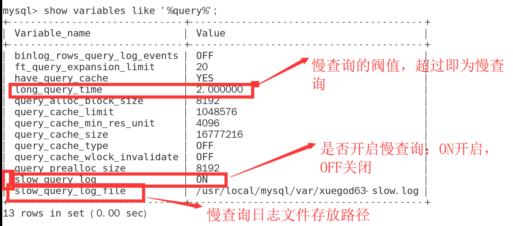
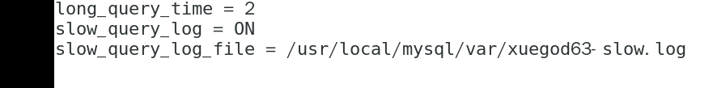
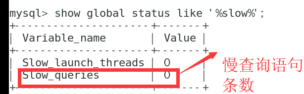
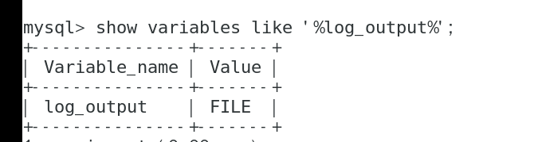
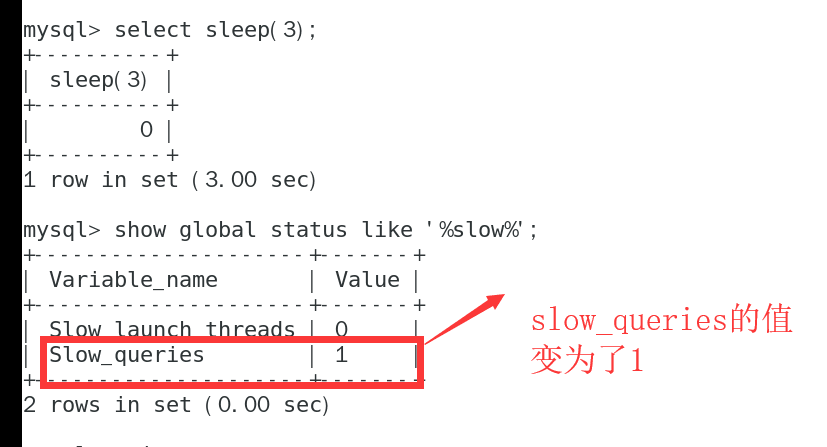
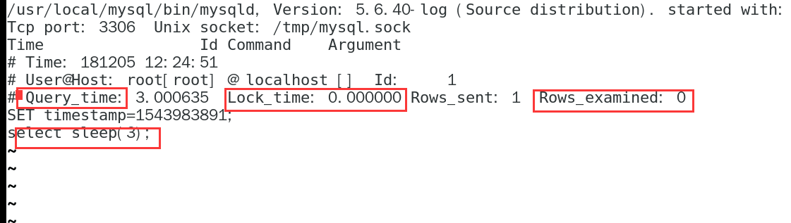

**MySql日志**
    
        MySQL日志包括：错误日志、二进制日志、通用查询日志和慢查询日志，这里说一下慢查询日志。
        

**开启慢查询**
    
        1：进入mysql命令行模式，执行： show variables like '%querr%';会看到
        

    如果临时开启慢查询：则执行 set global slow_query_log=ON;重启mysql后会失效。永久生效在my.cnf文件配置：在[mysqld] 下加入如下内容（版本不同，配置可能不同）：
    

    重启mysql服务即可生效。
    
**参数解释**
        
        在mysql命令行执行：show global status like '%slow%';会看到：

    执行：show variables like '%log_output%';查看记录日志的方式有TABLE和FILE两种类型

    
    我们执行一条sql：select sleep(3);然后再执行一下 ：show global status like '%slow%';会看到：
    

    退出命令行模式，查看慢查询日志文件：
    

    其中：query_time：查询时间，lock_time：锁表时间，rows_examined查询行数，select sleep（3）执行的语句
