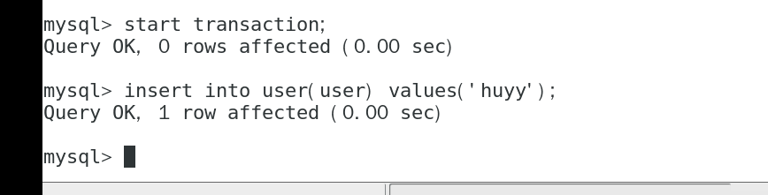
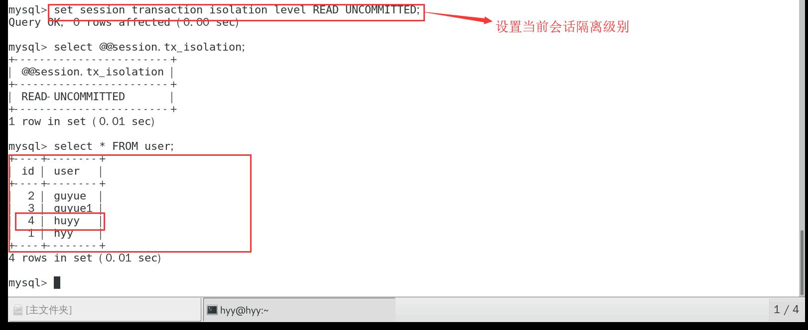
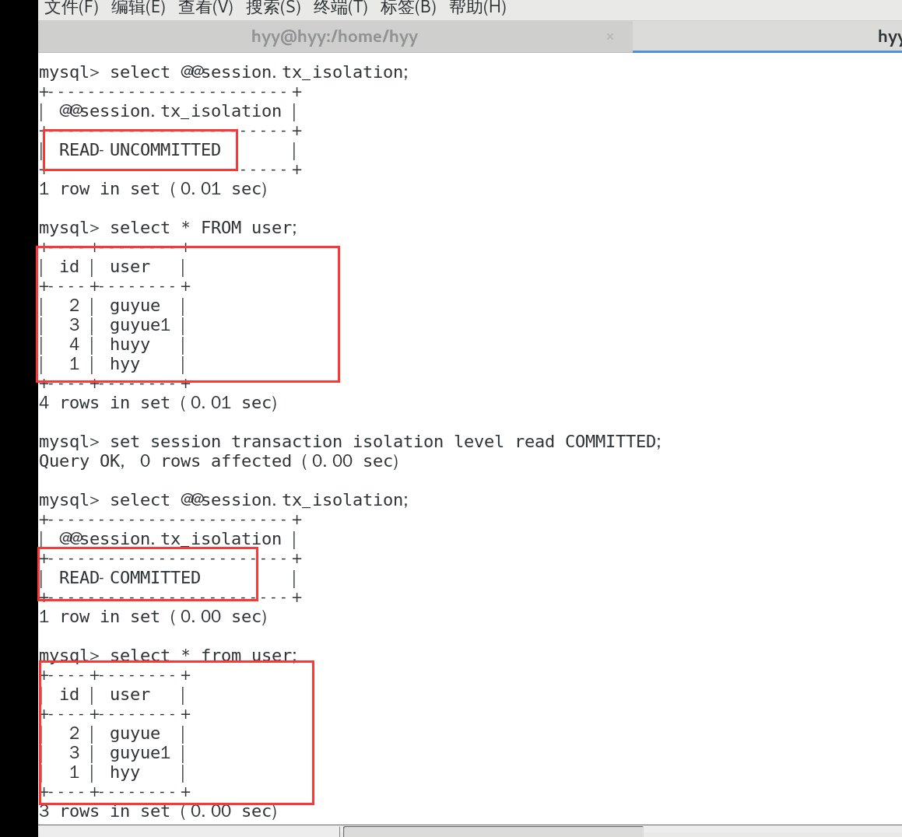
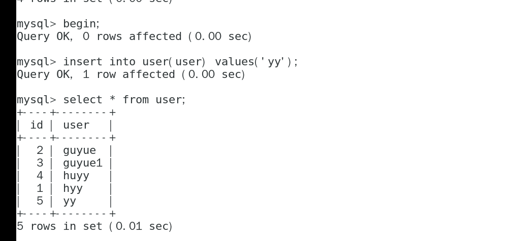
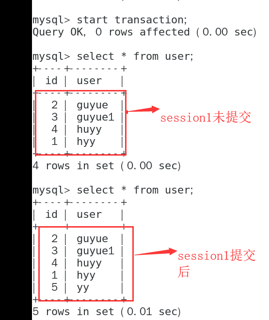
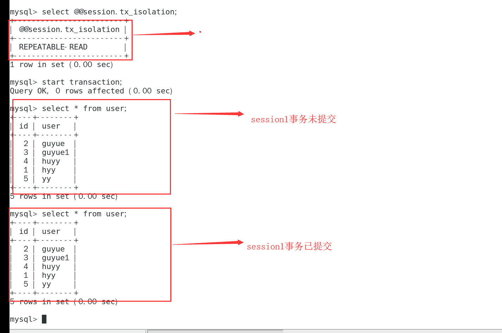
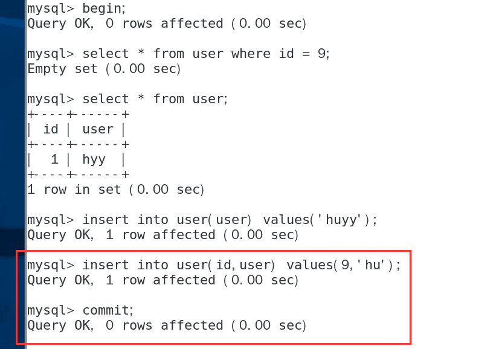
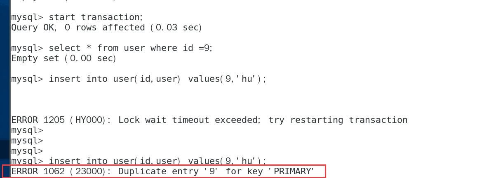
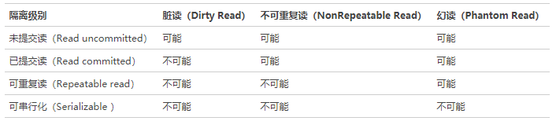

**数据库事务**
    
    数据库事务是数据库管理系统执行过程中的一个逻辑单位，由一个有限的的数据库操作序列构成。

**事务的ACID特性**
    
  数据库事务拥有以下四个特性，一般称为ACID特性
    
     .原子性（Atomicity）:事务作为一个整体被执行，包含在其中的对数据库的操作要么全部执行，要么都不执行。
     
     .一致性（Consistency）:事务应确保数据库的状态从一个状态到另一个状态。
     
     .隔离性（Isolation）:多个事务执行时，一个事务的执行不应影响其他事务的执行。
     
     .持久性（Durability）:已被提交的事务对数据库的修改应永久保存在数据库中。
     
**事务的隔离级别**
    
   数据库是个高并发的应用，同一时间会有大量的并发访问，为了有效的保证并发数据的的正确性，提出了事务隔离级别。
   
    .未提交读（Read uncommitted）:当前事务能够读取到其它事务已经更改但未提交的记录，如下图，一个事务插入数据但未提交，但是在这个隔离级别下可以读到。
    
    

    .已提交读（Read committed）:只能读取已提交的事务。如下图，未提交的数据没有读取。
    

    
    已提交读不会出现脏读（Dirty Read），但是会出现不可重复读（在session1、session2分别开启一个事务，并且在session1中插入一条数据，此时在session2中是无法取到结果的，当session1事务提交时，在session2可以读取到这条记录）；
    
    

    此时，session1事务未提交，session2的记录如下：

    
    没有读取到session1插入的数据，当session1提交后，
    

    .可重复读（Repeatable Read）:在同一个事务内的查询都是一致的，如下图：
    
    

      可重复读能解决不可重复读的问题，但会出现幻读（最典型的示例就是在一个事务中进行数据插入时，MySQL首先会先检查该数据是否存在，如果不存在则插入数据，这个过程中，如果另一个事务也插入了同样的数据，那么这个事务是会被阻塞的，如果当前事务提交了，那么另一个事务就会抛出主键冲突的异常）
      
        
        
session1
  

session2
    

    
    .可串行化（Serializable）隔离级别下则不会出现这种情况。因为在该隔离级别下时会锁表，因此不会出现幻读的情况，但这种隔离级别并发性极低。
    
      
   
