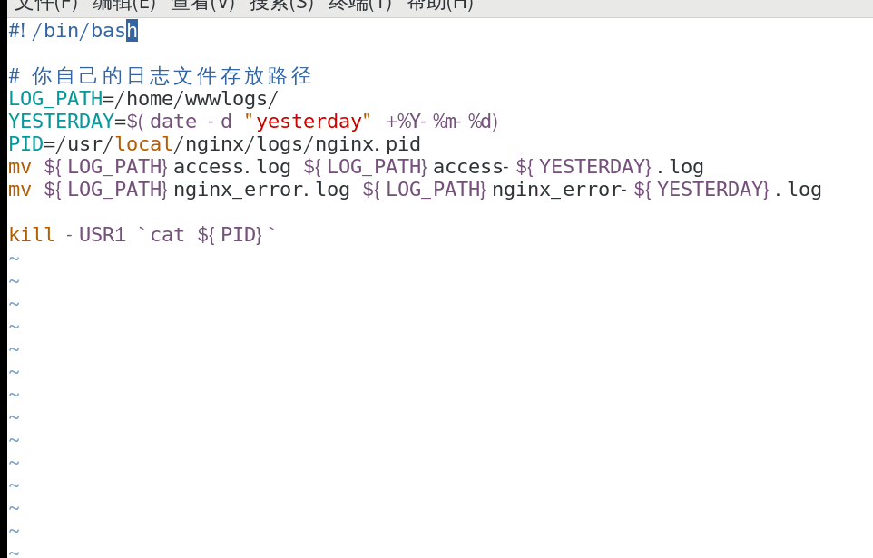
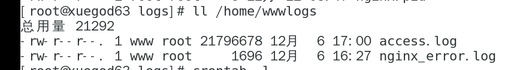

**nginx 日志文件切割**

    nginx的日志文件不会自动切割，我们可以写一个脚本来实现这个功能，如下：
    

    然后使用crontab命令编辑一个定时任务，为了测试脚本是否正确，我的计划任务如下：39 9 * * * /bin/bash /opt/nginx/cut_nginx_log.sh,任务执行前的文件目录：
    

    执行后的：

    到此，自动切割日志脚本已完成。
