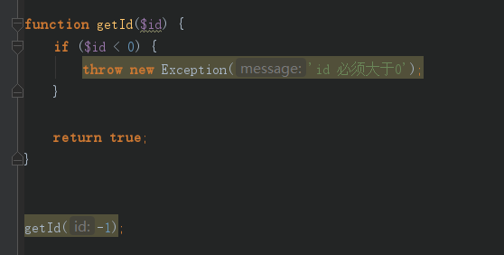
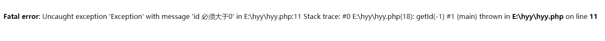
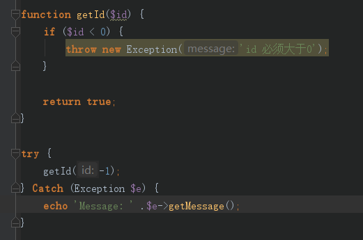
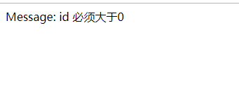
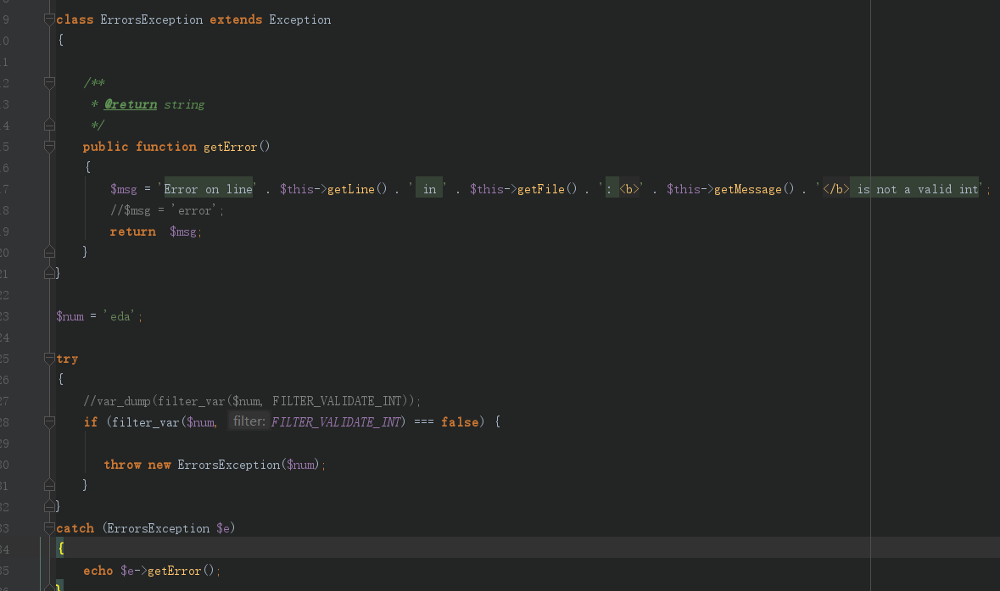
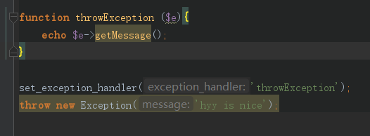

**什么是异常（Exception）**

        异常用于在指定的错误发生时改变脚本的正常的流程。

**异常基本使用**

        当异常被抛出时，其后的代码不会继续执行，PHP会尝试查找匹配的‘catch’代码块。
        如果异常没有被捕获，而且没使用set_exception_handler()作相应处理的话，那么将会发生致命错误，并且输出"Uncaught Exception"（未捕获异常）的错误消息。如下图：
      

      
  

    要避免上面的错误，我们需要创建适当的代码来处理异常：
    .Try - 使用异常的函数应该位于 "try" 代码块内。如果没有触发异常，则代码将照常继续执行。但是如果异常被触发，会抛出一个异常。
    .Throw - 这里规定如何触发异常。每一个 "throw" 必须对应至少一个 "catch"
    .Catch - "catch" 代码块会捕获异常，并创建一个包含异常信息的对象
    

**创建一个自定义的Exception类**

        创建自定义的异常处理程序非常简单。我们可以创建一个专门的类，当PHP中发生异常时，可调用其函数，该类必须是继承Exception类, 如下图：
        

        如果有多个异常时，可以使用if ... else ...或者switch代码块，这些异常能够使用不同的exception类，并返回不同的错误信息。
        
        对程序员来说，系统错误也许很重要，但是用户对它们并不感兴趣。为了让用户更容易使用，我们可以再次抛出带有对用户比较友好的异常：
        
**设置顶层异常处理器（Top Level Exception Handler）**

      set_exception_handler() 函数可设置处理所有未捕获异常的用户定义函数。
      

**异常的规则**
        
        ·需要进行异常处理的代码应该放入 try 代码块内，以便捕获潜在的异常。
        ·每个 try 或 throw 代码块必须至少拥有一个对应的 catch 代码块。
        ·使用多个 catch 代码块可以捕获不同种类的异常。
        ·可以在 try 代码块内的 catch 代码块中再次抛出（re-thrown）异常。
        
**如果抛出了异常，就必须捕获它**
