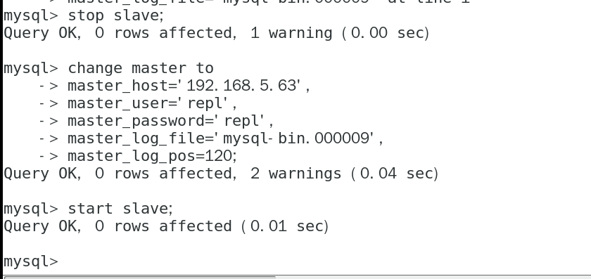

**_配置mysql主从复制，因为没有两台服务器，就用VMware搭建了两台虚拟机，搭建的lnmp环境。_**

**1**两台服务器

    master: 192.168.5.63
    slave:  192.168.5.64
    
**2** 配置master

    
    2.1、编辑master的my.cnf文件
        vim /etc/my.cnf

    sever-id=63:用户标识唯一数据库，我设置的与我ip最后一段相同；
    bin-ignore-db:同步时忽略的数据库（多个则添加多个）
    bin-do-db    :指定需要同步的数据库（多个则添加多个bin-do-db）
    
    

-
    
    
    
    2.2、添加一个具有replication slave权限的用户  
 

    2.3、重启mysql：service mysql restart
         然后连接：mysql -uroot -p
         执行：show master base
         

 
    file：指定的日志文件
    position：指定位置

**3** 配置slave库
    
     3.1、编辑slave的my.cnf文件
            vim /etc/my.cnf

    
    然后进入mysql，执行
    

    重启slave库，进入数据台，执行：show slave status \G
    

    当Slave_IO_Running:Yes
      Slave_SQL_Running:Yes时说明配置成功，如下图
      

