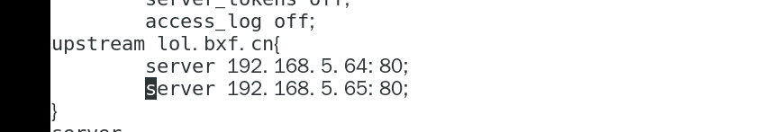
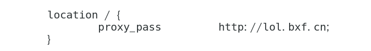
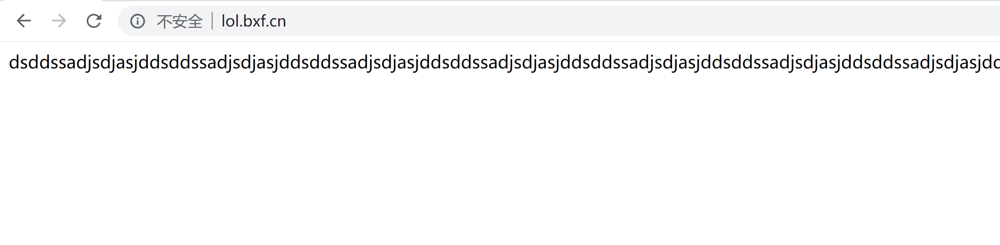
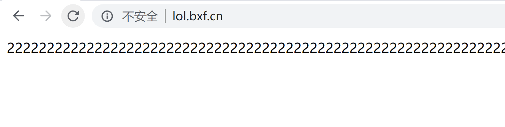

**1**
    
    负载均衡建立在现有网络结构之上，它提供了一种廉价有效透明的方法扩展网络设备和服务器的带宽、增加吞吐量、加强网络数据处理能力、提高网络的灵活性和可用性。
    负载均衡（Load Balance）其意思就是分摊到多个操作单元上进行执行，例如Web服务器、FTP服务器、企业关键应用服务器和其它关键任务服务器等，从而共同完成工作任务。
    
**2**

    负载均衡分为两种：一种是通过硬件，比如F5；一种是通过软件，比如LVS、nginx等，这里来讲述一下配置nginx负载均衡。
    
    nginx负载均衡的算法有轮询、权重（weight）、ip_hash、fair（ 比 weight、ip_hash更加智能的负载均衡算法，fair算法可以根据页面大小和加载时间长短智能地进行负载均衡，也就是根据后端服务器的响应时间 来分配请求，响应时间短的优先分配。Nginx本身不支持fair，如果需要这种调度算法，则必须安装upstream_fair模块。）、url_hash( 按访问的URL的哈希结果来分配请求，使每个URL定向到一台后端服务器，可以进一步提高后端缓存服务器的效率。Nginx本身不支持url_hash，如果需要这种调度算法，则必须安装Nginx的hash软件包)
    
**3**
    
    用VMware虚拟机搭建3台nginx服务器：
    IP分别为192.168.5.63、192.168.5.64 、192.168.5.65
    在IP为192.168.5.63的服务器的配置文佳里面配置,轮询算法： 
    
    在HTTP节点下
    
    
    若是使用ip_hash，代码如下：
    upstream lol.bxf.cn{
            ip_hash;
            server 192.168.5.64;
            server 192.168.5.65;
    }
    若是使用ip_hash，代码如下：
        upstream lol.bxf.cn{
                server 192.168.5.64 weight=5;
                server 192.168.5.65 weight=3;
        }

在server节点下配置

 

配置之后重启nginx，访问lol.bxf.cn,可以看到：
 
 
到此，nginx负载均衡已配置成功
